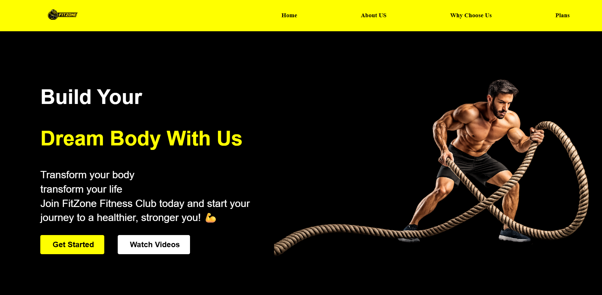
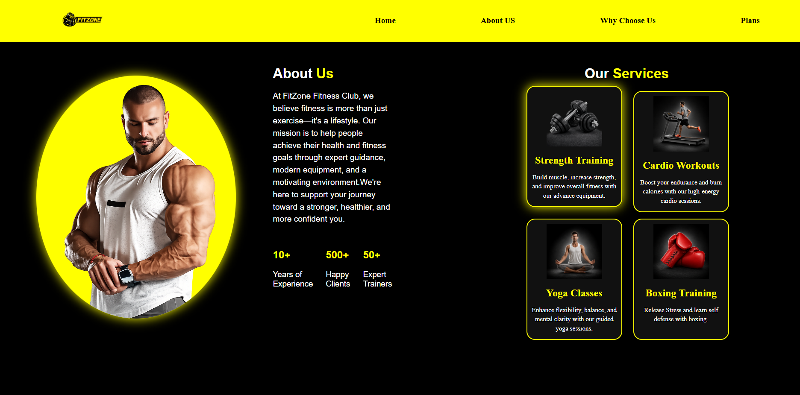

# 💪 FitZone Fitness Club

A modern, responsive, and visually appealing fitness club landing page built using **HTML5** and **CSS3**. This project demonstrates strong front-end development skills by implementing modern layouts, attractive UI design, smooth animations, interactive elements, and professional styling techniques.

Whether viewed on desktop or mobile, FitZone provides a clean and engaging user experience while showcasing a wide range of CSS concepts.

---

## 📌 Project Overview

FitZone Fitness Club is a responsive front-end website designed for a fitness center or gym. The website provides users with information about the gym, available services, membership plans, and the benefits of joining.

The main objective of this project was to strengthen my understanding of HTML and CSS by building a real-world landing page without using any CSS frameworks.

---

## ✨ Features

- 🏋️ Professional Gym Landing Page
- 📌 Sticky Navigation Bar
- 🎯 Responsive Hero Section
- 📖 About Us Section
- 💪 Services Section
- ⭐ Why Choose Us Section
- 💳 Membership Plans
- 🎨 Modern Black & Yellow Theme
- 🖼 Custom PNG Icons & Images
- ✨ Smooth CSS Animations
- 🎭 Interactive Hover Effects
- 🚀 Animated Hero Image
- 📱 Responsive Layout
- 📦 Clean & Organized Folder Structure

---

# 🛠 Technologies Used

- HTML5
- CSS3

---

# 🎨 CSS Concepts & Properties Used

This project demonstrates a wide range of CSS concepts and styling techniques.

## 📐 Layout & Positioning

- Flexbox
- CSS Grid
- Position (Relative, Sticky)
- Z-index
- Width & Height
- Min-height
- Margin
- Padding
- Gap
- Box Model
- Overflow

---

## 🎭 Typography & Text Styling

- Font Family
- Font Size
- Font Weight
- Text Alignment
- Line Height
- Text Decoration
- Letter Spacing
- Google Fonts (Poppins)

---

## 🎨 Colors & Styling

- Background Colors
- Text Colors
- Border
- Border Radius
- Box Shadow
- Object Fit
- Cursor
- Custom Color Theme

---

## ✨ Animations & Effects

- CSS Animations
- @keyframes
- Animation Delay
- Opacity Animation
- Transform
- TranslateX()
- TranslateY()
- Scale()
- Hover Effects
- Smooth Transitions

---

## 🖥 Display Properties

- Display Flex
- Display Grid
- Flex Direction
- Flex Grow
- Justify Content
- Align Items
- Align Self

---

## 📱 Responsive Design Concepts

- Relative Units (%, rem, vh, vw)
- Max Width
- Flexible Containers
- Responsive Images

---

## 🎨 UI Design Concepts

- Sticky Navigation
- Service Cards
- Pricing Cards
- Animated Hero Section
- Professional Layout
- Interactive Buttons
- Modern Landing Page Design
- Organized Content Sections

---

# 🚀 CSS Skills Demonstrated

✔ Selectors

✔ Colors & Backgrounds

✔ Typography

✔ Box Model

✔ Margin & Padding

✔ Borders

✔ Border Radius

✔ Flexbox

✔ CSS Grid

✔ Display Properties

✔ Position (Relative & Sticky)

✔ Z-index

✔ Width & Height

✔ Min/Max Dimensions

✔ Overflow

✔ Object Fit

✔ Pseudo Classes (:hover)

✔ CSS Transitions

✔ CSS Transform

✔ CSS Animations

✔ @keyframes

✔ Opacity

✔ Box Shadow

✔ Cursor Styling

✔ Responsive Units

✔ Modern Card Design

✔ Professional Landing Page Design

---

# 📂 Project Structure

```
FitZone/
│
├── assets/
│   ├── logo.png
│   ├── hero-image.png
│   ├── about.png
│   ├── strength.png
│   ├── cardio.png
│   ├── yoga.png
│   ├── boxing.png
│   ├── trainer.png
│   ├── modern-equipment.png
│   ├── personal-guidance.png
│   ├── flexible-time.png
│   ├── running-boy.gif
│   └── ...
│
├── index.html
├── style.css
└── README.md
```

---

# 🚀 How to Run

### Clone the repository

```bash
git clone https://github.com/vedant200507/FitZone.git
```

### Open the project

Navigate to the project folder.

Open **index.html** in your browser

OR

Run using **Live Server** in Visual Studio Code.

---

## 📸 Screenshots

### 🏠 Home Page



---

### 💪 About & Services



---

### ⭐ Why Choose Us


---

### 💳 Membership Plans


# 📚 Learning Outcomes

This project helped me strengthen my understanding of:

- HTML5 Semantic Elements
- CSS Selectors
- CSS Specificity
- CSS Box Model
- Flexbox Layout
- CSS Grid Layout
- Responsive Web Design
- Typography
- Color Theory
- Positioning
- Sticky Navigation
- Transform Properties
- CSS Animations
- CSS Transitions
- Hover Effects
- Responsive Units
- Image Styling
- Card UI Design
- Modern Landing Page Design
- Project Folder Organization
- Git & GitHub Workflow

---

# 🔮 Future Improvements

- Add JavaScript Interactivity
- Dark / Light Theme Toggle
- BMI Calculator
- Contact Form
- Trainer Profiles
- Testimonials Section
- Gallery Section
- Membership Registration Form
- Backend Integration
- Mobile Navigation Menu
- Booking System

---

# 👨‍💻 Author

## Vedant Kolapkar

**Aspiring Full Stack Java Developer**

### Connect with me

- 🔗 GitHub: https://github.com/vedant200507
- 💼 LinkedIn: https://www.linkedin.com/in/vedant-kolapkar-ab6242242

---

# ⭐ Show Your Support

If you liked this project, please consider giving it a **⭐ Star** on GitHub.

Your support motivates me to build more exciting projects and continuously improve my development skills.

---

## 📄 License

This project is created for learning and portfolio purposes.

© 2026 Vedant Kolapkar. All Rights Reserved.
